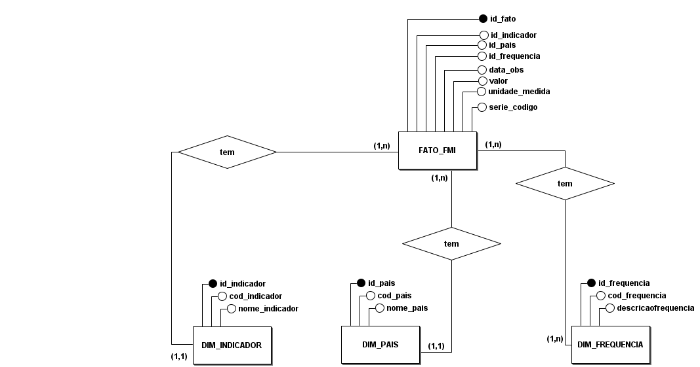
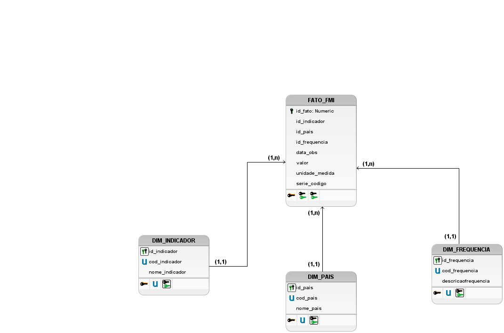

# Projeto ETL - Dados do FMI (TrabalhoSBD2)

[](https://airflow.apache.org/)
[](https://spark.apache.org/)
[](https://python.org/)
[](https://docker.com/)

> **Objetivo:** Desenvolver um **pipeline de ETL (Extract, Transform, Load)** automatizado para **coleta, processamento e análise de dados do Fundo Monetário Internacional (FMI)**, utilizando **Apache Airflow** e **Apache Spark**.

---

## Visão Geral

Este projeto implementa uma arquitetura moderna de **ETL orientada a dados**, capaz de coletar informações diretamente da **API SDMX do FMI**, transformá-las via **Spark** e armazenar os resultados em formato analítico (Parquet, CSV e JSON).
Todo o fluxo é **automatizado pelo Airflow**, garantindo escalabilidade, reprodutibilidade e rastreabilidade completa do processo.

---

## Arquitetura do Sistema

```
TrabalhoSBD2/
├── docker-compose.yml      # Orquestração dos serviços (Airflow, Spark, Postgres)
├── Makefile               # Automação de build e execução
├── .env                    # Variáveis de ambiente
├── requirements.txt        # Dependências Python
│
├── airflow/                # Configurações e DAGs do Airflow
│   ├── dags/                  # Pipelines ETL (coleta, limpeza e transformação)
│   ├── logs/                  # Logs de execução
│   ├── plugins/               # Plugins e hooks customizados
│   └── config/                # Configurações adicionais
│
├── base_dados/             # Dados brutos e processados
│   ├── BOP/                   # Balance of Payments
│   ├── ER/                    # Exchange Rates
│   ├── IIP/                   # International Investment Position
│   ├── IRFCL/                 # International Reserves
│   └── Resultados/            # Saídas finais dos pipelines
│
├── spark_config/           # Configurações e scripts Spark
├── notebooks/              # Jupyter notebooks analíticos
└── Resultados/             # Indicadores agregados e relatórios
```

---

## Tecnologias Principais

| Camada             | Tecnologia                                    | Descrição                              |
| ------------------ | --------------------------------------------- | -------------------------------------- |
| **Orquestração**   | [Apache Airflow](https://airflow.apache.org/) | Agendamento e automação dos pipelines  |
| **Processamento**  | [Apache Spark](https://spark.apache.org/)     | Transformações e análises distribuídas |
| **Armazenamento**  | PostgreSQL / Parquet / CSV / JSON             | Dados intermediários e resultados      |
| **Infraestrutura** | Docker Compose                                | Ambientes isolados e reproduzíveis     |
| **Linguagem**      | Python 3.12                                   | Scripts ETL, análise e automação       |

---

## Como Executar

### Pré-requisitos

* Docker e Docker Compose instalados
* 8GB+ RAM disponível
* Portas **8081** (Airflow) e **5433** (PostgreSQL) livres

### Instalação

```bash
# 1. Clone o repositório
git clone https://github.com/seu-usuario/TrabalhoSBD2.git
cd TrabalhoSBD2

# 2. Inicialize o ambiente completo
make init
```

Após o processo, os serviços estarão disponíveis em:

* **Airflow Web UI:** [http://localhost:8081](http://localhost:8081)
 Usuário: `admin` | 🔐 Senha: `admin123`
* **PostgreSQL:** `localhost:5433`
* **Data Warehouse:** `data_warehouse` (schemas: staging, bronze, silver, gold)

---
 **Conexão PostgreSQL**                  

 **Host:**          localhost            
 **Port:**          5433                 
 **Database:**      data_warehouse       
 **Username:**      airflow              
 **Password:**      airflow              
 **Show all databases:** (marcado)       

---

## Pipelines ETL

Os pipelines são executados automaticamente pelo Airflow em horários configurados.
Cada DAG representa uma coleta e transformação de um dataset específico do FMI:

| DAG                     | Fonte FMI | Descrição                             | Horário |
| ----------------------- | --------- | ------------------------------------- | ------- |
| `bop_data_collection`   | BOP       | Balança de Pagamentos                 | 02:00   |
| `er_data_collection`    | ER        | Taxas de Câmbio                       | 02:15   |
| `iip_data_collection`   | IIP       | Posição de Investimento Internacional | 02:30   |
| `irfcl_data_collection` | IRFCL     | Reservas Internacionais               | 02:45   |

---

## Processamento de Dados (Spark)

* Execução distribuída em cluster Spark local
* Transformações estatísticas e temporais
* Detecção automática de outliers
* Enriquecimento de dados e agregações
* Exportação para múltiplos formatos (Parquet, CSV, JSON)

Exemplo simplificado:

```python
from spark_config.config import get_banking_spark_session
import pyspark.sql.functions as F

spark = get_banking_spark_session("Analise_FMI")

df = spark.read.csv("/opt/airflow/base_dados/Resultados/BOP.csv", header=True, inferSchema=True)

result = (df.groupBy("COUNTRY")
          .agg(F.sum("VALUE").alias("total_valor"),
               F.avg("VALUE").alias("media_valor"))
          .orderBy(F.desc("total_valor")))

result.show(10, truncate=False)
spark.stop()
```

---

## Comandos Makefile Principais

```bash
# Ver comandos disponíveis
make help

# Inicializar projeto completo
make init

# Subir / parar / reiniciar serviços
make up
make down
make restart

# Monitoramento
make status       # Containers ativos
make logs         # Logs dos serviços
make logs-follow  # Logs em tempo real
make health       # Health check

# Limpeza
make clean        # Containers e volumes
make clean-all    # Tudo + imagens Docker
```

# Modelo e Diagrama Entidade-Relacionamento (MER / DER)

Este documento apresenta a estrutura lógica do modelo de dados, ilustrando as entidades (tabelas) e os relacionamentos estabelecidos para integrar os domínios de Contas Externas (BOP, IIP, IRFCL, ER) e Demografia (DEMOGRAPHY).

---

## 1. Diagrama Entidade-Relacionamento (DER)

Primeiramente desenvolveu-se o DER para representar os dados da maneira como foram extraídos:


Afim de esclarecer a futura estrutura que será utilizada na camada Gold, foi desenvolvido, também o DER da futura estrutura do Data Lakehouse:



## 2. Diagrama Lógico de Dados (DLD)

Complementarmente ao DER, evolui-se os Diagramas Entidade-Relacionamento para um modelo mais próximo do nível físico, os chamados Diagramas Lógicos de Dados (DLD).

Segue, respectivamente, o DLD da estrutura dos dados e da estrutura que será usada na camada Gold.

Dados:


Schema:




