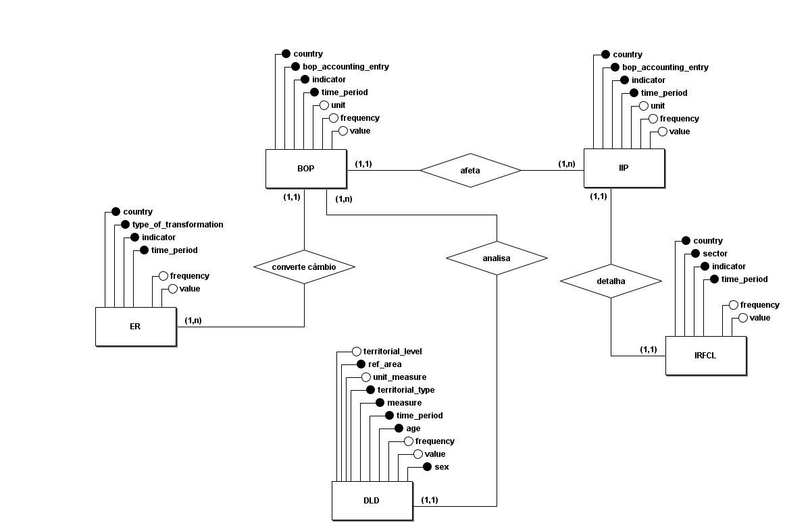

# Modelagem de Dados (MER / DER)

Este documento apresenta a estrutura lógica do modelo de dados, ilustrando as entidades (tabelas) e relacionamentos para integrar os domínios de Contas Externas (BOP, IIP, IRFCL, ER) e Demografia (DEMOGRAPHY).

---

## 1. Diagrama Entidade-Relacionamento (DER)

Primeiramente desenvolveu-se o DER para representar os dados da maneira como foram extraídos:

Afim de esclarecer a futura estrutura que será utilizada na camada Gold, foi desenvolvido, também o DER da futura estrutura do Data Lakehouse:

## 2. Diagrama Lógico de Dados (DLD)

Complementarmente ao DER, os Diagramas Lógicos de Dados (DLD) aproximam o desenho do nível físico adotado na camada Gold.

Segue, respectivamente, o DLD da estrutura dos dados e da estrutura que será usada na camada Gold.

Dados:

O schema previsto concentra uma tabela Fato principal, relacionada diretamente às dimensões País, Frequência e Indicador.

