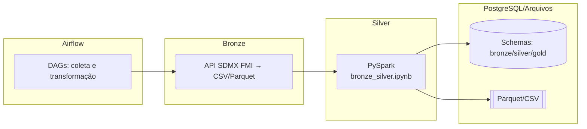

## Arquitetura do Pipeline

O pipeline segue um desenho clássico de Lakehouse com camadas Bronze, Silver e futura Gold, orquestrado pelo Airflow:

- Coleta (Bronze): notebooks/scripts em `data_layer/raw/` acessam a API SDMX do FMI e gravam CSV/Parquet em `data_layer/raw/Resultados/`.
- Transformação (Silver): notebook `transformer/job_etl/bronze_silver.ipynb` (executado por DAG) normaliza e integra dados para a camada Silver, podendo carregar em PostgreSQL.
- Orquestração: DAGs em `airflow/dags/` coordenam a execução, logs e dependências.
- Armazenamento: PostgreSQL (schemas bronze/silver/gold) e arquivos analíticos (Parquet/CSV).

### Diagrama do fluxo (alto nível)



### Estrutura do repositório (resumo)

```
TrabalhoSBD2/
├── docker-compose.yml      # Orquestração dos serviços (Airflow, Spark, Postgres)
├── Makefile                # Automação de build e execução
├── requirements.txt        # Dependências Python
├── airflow/                # DAGs, logs, plugins e configs do Airflow
├── data_layer/             # Camadas de dados do Lakehouse
│   ├── raw/                # Camada Bronze - Dados brutos da API SDMX
│   ├── silver/             # Camada Silver - Dados normalizados
│   └── gold/               # Camada Gold - Dados analíticos (futura)
├── transformer/            # Scripts e notebooks de transformação
│   └── job_etl/            # Jobs ETL (bronze_silver, silver_gold)
├── spark_config/           # Helpers e configs do Spark
├── postgres/               # Scripts de inicialização do DW
├── notebooks/              # Notebooks auxiliares
└── Resultados/             # Saídas e execuções registradas (legado)
```
